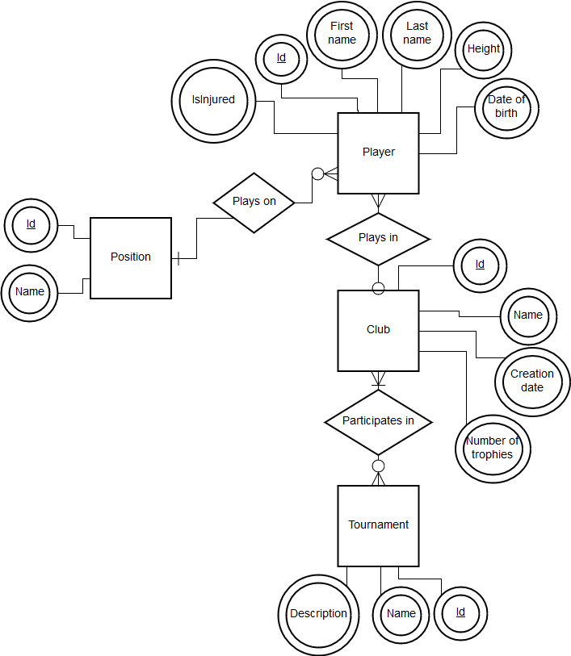
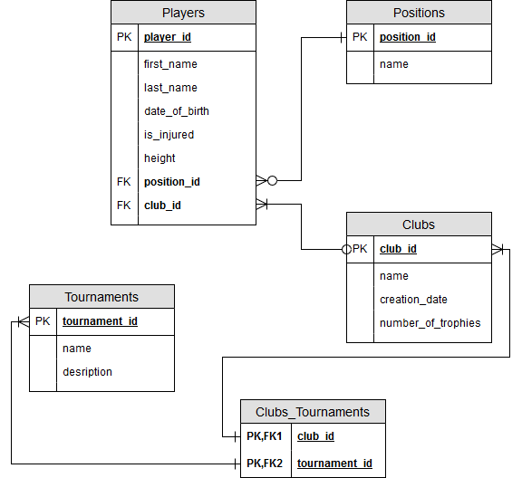
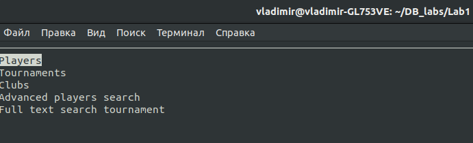
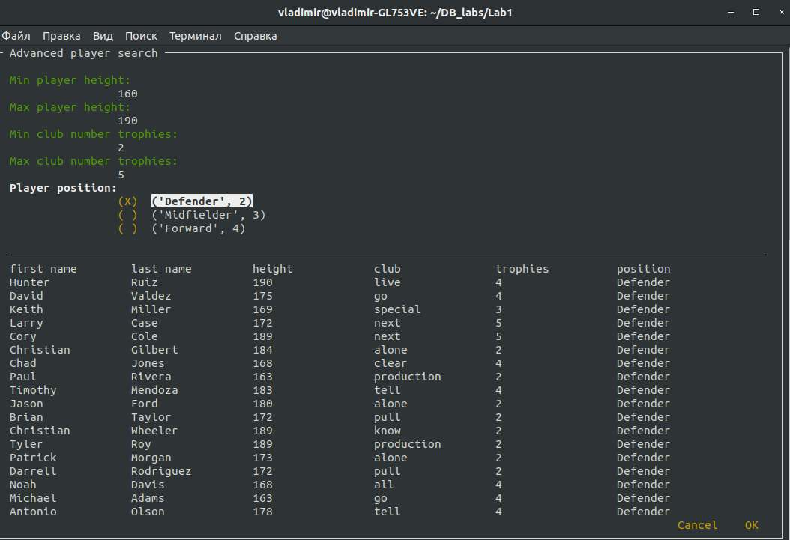
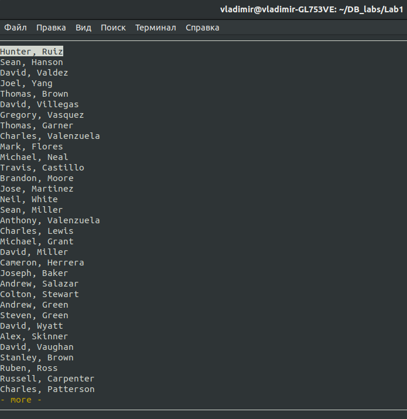

## Лабораторна робота № 2.
### Ознайомлення з базовими операціями СУБД PostgreSQL
#### Варіант №13:
* Пошук за атрибутами: *діапазон чисел, перелічення*
* Повнотекстовий пошук: *обов’язкове входження слова, ціла фраза*

#### Графічне подання розробленої моделі «сутність-зв’язок»

#### Структура бази даних

#### 2-3 копії екранних форм (screenshots).

#### Головне меню

#### Пошук по гравцям

####Список гравців
