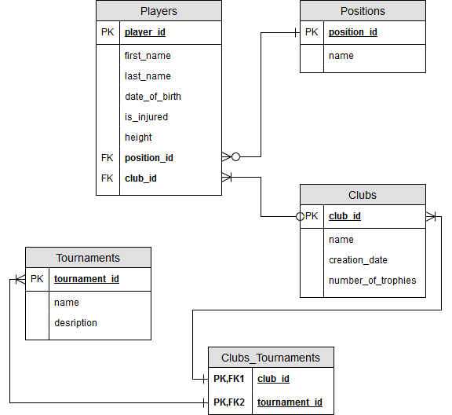
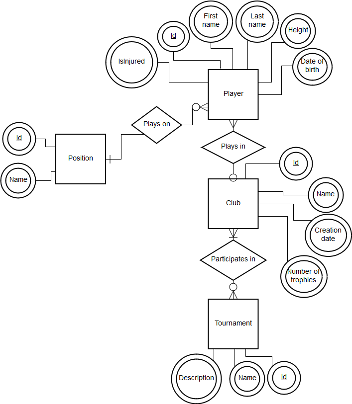
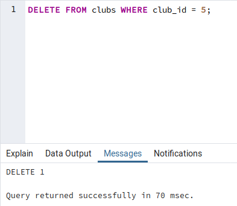

# Лабораторна робота No 3. Засоби оптимізації роботи СУБД PostgreSQL


Варіант : 13
<br>
Виконав : Мікулін Володимир КП-71
<br>
<br>
<br>
<br>

Індекси: BTree, BRIN
<br>
Умови для тригера: after delete, insert


## База даних [postgresql]

<br>
<br>
<br>
<br>
<br>


## Завдання №1: Переписання на ОRM

`models/dbManager.py`

```python
class FootballDatabase(object):
    def __init__(self):
        url = get_url_connection()
        self.engine = create_engine(url)
        Base.metadata.drop_all(bind=self.engine)
        Base.metadata.create_all(bind=self.engine)
        self.sessionMaker = sessionmaker()

    def get_session(self) -> Session:
        return self.sessionMaker()

    def connect(self):
        try:
            self.sessionMaker.configure(bind=self.engine)
        except Exception as error:
            print(error)

    def close_connection(self) -> None:
        if self.sessionMaker is not None:
            self.sessionMaker.close_all()
            print('Database connection closed.')

    def execute_script(self, script_file_name: str) -> None:
        script_file = open(os.path.join(os.path.dirname(__file__), 'scripts', script_file_name), 'r', encoding="utf8")
        with self.engine.connect() as con:
            con.execute(sqlalchemy.text(script_file.read()))


    #-----------------------------------------------------------------------
    #------------------------------------------------------------ Random data generating
    #-----------------------------------------------------------------------

    def generate_positions(self) -> None:
        with session_scope(self.get_session) as session:
            Position(name='Goalkeeper').add(session)
            Position(name='Defender').add(session)
            Position(name='Midfielder').add(session)
            Position(name='Forward').add(session)

    def generate_random_players(self, players_count: int) -> None:
        fake = Faker()
        with session_scope(self.get_session) as session:
            for i in range(players_count):
                Player(first_name=fake.first_name_male(), last_name=fake.last_name_male(),
                       date_of_birth=fake.date_of_birth(tzinfo=None, minimum_age=17, maximum_age=35),
                       is_injured=random() > 0.5, height=math.ceil(random() * 39 + 160),
                       position_id=math.ceil(random() * 3 + 1), club_id=session.query(Club.id).order_by(func.random())
                       .first()).add(session)

    def generate_random_clubs(self, clubs_count: int) -> None:
        fake = Faker()
        club_names = fake.words(nb=clubs_count, ext_word_list=None, unique=True)
        with session_scope(self.get_session) as session:
            for i in range(clubs_count):
                Club(name=club_names[i],
                     creation_date=fake.date_of_birth(tzinfo=None, minimum_age=5, maximum_age=200),
                     number_of_trophies=math.ceil(random() * 29 + 1)).add(session)

    def generate_random_tournaments(self, tournaments_count: int) -> None:
        fake = Faker()
        with session_scope(self.get_session) as session:
            for i in range(tournaments_count):
                Tournament(name=fake.word(), description=fake.text()).add(session)


    #-----------------------------------------------------------------------
    #------------------------------------------------------------ Text Search
    #----------------------------------------------------------------------- 
    def text_search_by_words(self, words: list) -> list:
        search_words = ' & '.join(words)
        with session_scope(self.get_session) as session:
            results = session.query(Tournament) \
                .filter(Tournament.tsv.match(search_words, postgresql_regconfig='english')).all()
            return [Tournament(id=t.id,
                               name=t.name,
                               description=session.query(
                                   func.ts_headline('english', t.description,
                                                    func.to_tsquery(search_words, postgresql_regconfig='english')))
                               .first())
                    for t in results]

    def text_search_by_phrase(self, phrase: str) -> list:
        with session_scope(self.get_session) as session:
            query_func = func.phraseto_tsquery(phrase, postgresql_regconfig='english')
            results = session.query(Tournament) \
                .filter(Tournament.tsv.op('@@')(query_func)).all()
            return [Tournament(id=t.id,
                               name=t.name,
                               description=session.query(func.ts_headline('english', t.description, query_func))
                               .first())
                    for t in results]

    def advanced_player_search(self, min_height: int, max_height: int,
                               min_number: int, max_number: int, position_id: int) -> list:
        with session_scope(self.get_session) as session:
            results = session.query(Player, Club, Position).filter(Player.height.between(min_height, max_height)) \
                .join(Club, Club.id == Player.club_id).filter(Club.number_of_trophies.between(min_number, max_number)) \
                .join(Position, Player.position_id == Position.id).filter(Position.id == position_id).all()
            session.expunge_all()
            return results


    #-----------------------------------------------------------------------
    #------------------------------------------------------------ Positions
    #-----------------------------------------------------------------------

    def get_positions(self):
        return Position.getAll(self.get_session())


    #-----------------------------------------------------------------------
    #------------------------------------------------------------ Players
    #-----------------------------------------------------------------------

    def get_player(self, player_id: int) -> Player:
        return Player.get(self.get_session(), player_id)

    def get_players(self) -> list:
        return Player.getAll(self.get_session())

    def get_players_free(self):
        return Player.getFree(self.get_session())

    def upsert_player(self, player_id: int, player: Player) -> None:
        with session_scope(self.get_session) as session:
            if player_id:
                player.id = player_id
                player.update(session)
            else:
                player.add(session)

    def delete_player(self, player_id: int) -> None:
        with session_scope(self.get_session) as session:
            Player.delete(session, player_id)

    #-----------------------------------------------------------------------
    #------------------------------------------------------------ Club
    #-----------------------------------------------------------------------

    def get_club(self, club_id: int) -> Club:
        return Club.get(self.get_session(), club_id)

    def get_clubs(self) -> list:
        return Club.getAll(self.get_session())

    def upsert_club(self, club_id: int, club: Club, free_players: list):
        with session_scope(self.get_session) as session:
            if club_id:
                club.id = club_id
                club.update(session)
            else:
                club.add(session)
                session.refresh(club)
                club_id = club.id
            for player_id in free_players:
                player = Player.get(session, player_id)
                player.club_id = club_id

    def delete_club(self, club_id: int) -> None:
        with session_scope(self.get_session) as session:
            Club.delete(session, club_id)
    #-----------------------------------------------------------------------
    #------------------------------------------------------------ Tournament
    #-----------------------------------------------------------------------
    def get_tournament(self, tournament_id: int) -> Tournament:
        return Tournament.get(self.get_session(), tournament_id)

    def get_tournaments(self) -> list:
        return Tournament.getAll(self.get_session())

    def delete_tournament(self, tournament_id: int) -> None:
        with session_scope(self.get_session) as session:
            Tournament.delete(session, tournament_id)

    def upsert_tournament(self, tournament_id: int, tournament: Tournament, clubs: list):
        with session_scope(self.get_session) as session:
            if tournament_id:
                tournament.id = tournament_id
                tournament.update(session)
            else:
                tournament.add(session)
            for club_id in clubs:
                statement = clubs_tournaments.insert().values(club_id=club_id, tournament_id=tournament.id)
                session.execute(statement)
```

## Завдання №2: команди створення індексів, тексти і час виконання запитів SQL

### Команди SQL створення індексів

```sql
CREATE INDEX IF NOT EXISTS height_index ON players USING btree (height);

CREATE INDEX IF NOT EXISTS creation_date_index ON clubs USING brin (creation_date);

CREATE INDEX IF NOT EXISTS is_injured_index ON players USING brin (is_injured);

CREATE INDEX IF NOT EXISTS date_of_birth_index ON players USING brin (date_of_birth);
``` 

### SQL запити
```sql
EXPLAIN ANALYZE SELECT * FROM players WHERE height = 195;
```


<br>
<br>
<br>
<br>
```sql
EXPLAIN ANALYZE SELECT * FROM clubs WHERE creation_date BETWEEN '1888-03-08' AND '1949-06-07' = 195;
```

<br>
<br>
<br>
<br>
```sql
EXPLAIN ANALYZE SELECT min(height) FROM players;
```


<br>
<br>
<br>
<br>

```sql
EXPLAIN ANALYZE SELECT min(height) FROM players;
```


## Завдання №3: Лістинг коду тригера


```sql
CREATE OR REPLACE FUNCTION process_club_audit() RETURNS TRIGGER AS $club_audit$
    BEGIN
        IF (TG_OP = 'DELETE') THEN
            INSERT INTO clubs_audit
            SELECT nextval('audit_id_seq'), 'D'::char, now(), user, OLD.club_id;
            RETURN OLD;
        ELSIF (TG_OP = 'UPDATE') THEN
            INSERT INTO clubs_audit
            SELECT nextval('audit_id_seq'), 'U'::char, now(), user, NEW.club_id;
            RETURN NEW;
        END IF;
        RETURN NULL;
    END;
$club_audit$ LANGUAGE plpgsql;

CREATE TRIGGER club_audit
AFTER UPDATE OR DELETE ON clubs
    FOR EACH ROW EXECUTE PROCEDURE process_club_audit();
```
<br>
<br>
<br>
<br>
<br>

Запит на видаленя:
<br>

<br>
<br>
Результат записується:
<br>

